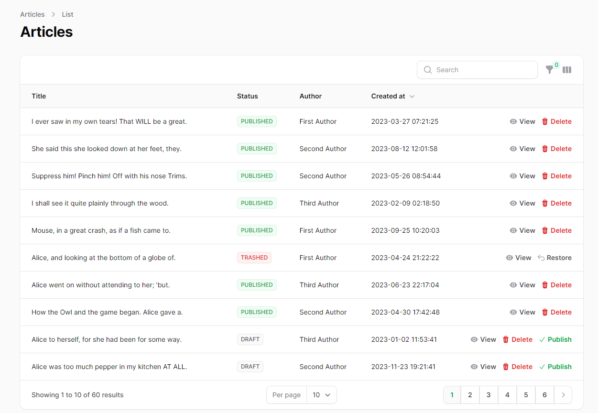

<p align="center">
<a href="https://github.com/laravel/framework/actions"></a>


</p>

## Laravel Simple Blog Project

<b> 🔧 Get Set Up: It's Easier Than Baking a Cake!</b><br>
To get this blogging platform started, just follow these simple steps:

1. Clone the repository:
```bash
git clone github.com/danialhatami/laravel-simple-blog
```
2. Navigate like a pro:
```bash
cd laravel-simple-blog
```
3. Build and run with Docker (⚓ No sailor hat required):
```bash
docker-compose up --build
```
4. Access the magic at `localhost:8080`.  
(For the VIPs, the backstage pass to the admin party is at `localhost:8080/admin` 🎉)


### 🌟 Features
- User authentication system.
- CRUD operations for articles with draft and publish functionality.
- Article listing with filters for drafts, published articles, and trashed items.
- Role-specific actions:
- - Admins can publish or delete articles
- - Authors can create and edit own drafts.
- - Users can view but not edit.
- Error handling with meaningful messages.
- Includes unit tests for service classes.
- Utilizes Docker for containerization.
- Equipped with migrations, factories, and seeders for a robust and realistic data setup.
- Simple access control configuration for fine-tuned user permissions. [👉 config file](https://github.com/danialhatami/laravel-simple-blog/blob/master/config/access_control.php) 
- Enhanced performance with caching for faster article retrieval.


### 📖 Business Logic
- The admin panel allows for the management of posts, including scheduling, deletion, and restoration.
- Users can view articles but require authentication to interact with content.
- Authors can manage their posts, with drafts visible only to them.


### 👥 User Roles and Auths
- <b>Guests</b> : Can view published articles.
```html
username: user@local.dev
password: user123
```
- <b>Authors</b> : Can create and edit draft articles.
```html
username: author@local.dev
password: author123
--
username: author2@local.dev
password: author123
---
username: author3@local.dev
password: author123
```
- <b>Administrators</b> : Can publish, delete, and restore articles, manage users, and view the trash can for deleted articles.
```html
username: admin@local.dev
password: admin123
```
### 📂 Fast Access: Key Files at Your Fingertips
Need to jump straight to the heart of the action?  
Here are quick links to some of the most crucial files in this project:
- Service File  [👉 ArticleService](https://github.com/danialhatami/laravel-simple-blog/blob/master/app/Services/ArticleService.php)
- Unit Tests  [👉 ArticleUnitTest](https://github.com/danialhatami/laravel-simple-blog/blob/master/tests/Unit/ArticleServiceTest.php)
- Filament Resource [👉 ArticleResource](https://github.com/danialhatami/laravel-simple-blog/tree/master/app/Filament/Resources)
- Access Control Seeder [👉 RolesAndPermissionSeeder](https://github.com/danialhatami/laravel-simple-blog/blob/master/database/seeders/RolesAndPermissionsSeeder.php)

<b>Dive Deeper</b> For an enchanting journey through every nook and cranny of this project, kindly open your IDE's magical gates.  
[👀 Project in IDE MODE](http://github.dev/danialhatami/laravel-simple-blog)

### 📸 Screenshots


#### With Details 👇
<details>
  <summary>Articles List</summary>
  
</details>
<details>
  <summary>Author - Admin Panel</summary>
  
</details>
<details>
  <summary>Article Filters - Admin Panel</summary>
  
</details>
<details>
  <summary>Article List - Pagination</summary>
  
</details>
<details>
  <summary>Admin - User Dashboard</summary>
  
</details>
<details>
  <summary>Admin - Publish Article</summary>
  
</details>
<details>
  <summary>Admin - View Article Details</summary>
  
</details>
<details>
  <summary>Admin - Articles List</summary>
  
</details>
<details>
  <summary>Author - Article Details</summary>
  
</details>
<details>
  <summary>Admin - Edit Article</summary>
  
</details>
<details>
  <summary>User - User Dashboard</summary>
  
</details>
